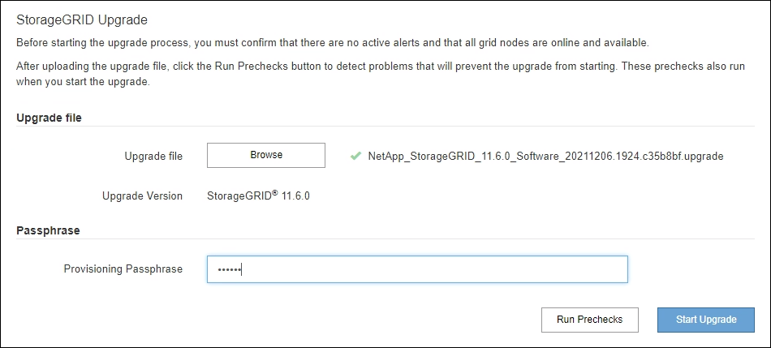
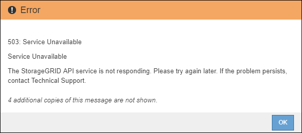

= Execute a atualização
:allow-uri-read: 
:icons: font
:imagesdir: ../media/

[role="lead"]
Quando estiver pronto para executar a atualização, selecione o `.upgrade` arquivo e insira a senha de provisionamento. Como opção, você pode executar as pré-verificações de atualização antes de executar a atualização real.

.O que você vai precisar
Você revisou todas as considerações e concluiu todas as etapas de Planejamento e preparação.

== Carregue o ficheiro de atualização

. Faça login no Gerenciador de Grade usando um xref:../admin/web-browser-requirements.adoc[navegador da web suportado].
. Selecione *Manutenção* *sistema* *Atualização de Software*.
+
A página Atualização de software é exibida.

. Selecione *Atualização StorageGRID*.
. Na página Atualização do StorageGRID, selecione o `.upgrade` arquivo.
+
.. Selecione *Procurar*.
.. Localize e selecione o arquivo: `NetApp_StorageGRID_11.6.0_Software_uniqueID.upgrade`
.. Selecione *Open*.
+
O arquivo é carregado e validado. Quando o processo de validação for concluído, uma marca de seleção verde aparece ao lado do nome do arquivo de atualização.

. Insira a senha de provisionamento na caixa de texto.
+
Os botões *Run Prechecks* e *Start Upgrade* ficam ativados.

+

== Execute as pré-verificações

Opcionalmente, você pode validar a condição do seu sistema antes de iniciar a atualização real. Selecionar *Executar pré-verificações* permite detetar e resolver problemas antes de iniciar a atualização. As mesmas pré-verificações são realizadas quando você inicia a atualização. As falhas de pré-verificação interromperão o processo de atualização e algumas podem exigir o envolvimento do suporte técnico para serem resolvidas.

. Selecione *Executar pré-verificações*.
. Aguarde até que as pré-verificações sejam concluídas.
. Siga as instruções para resolver quaisquer erros de pré-verificação relatados.
+

IMPORTANT: Se tiver aberto quaisquer portas de firewall personalizadas, será notificado durante a validação de pré-verificação. Você deve entrar em Contato com o suporte técnico antes de prosseguir com a atualização.

== Inicie a atualização e atualize o nó de administração principal

Quando a atualização é iniciada, as pré-verificações de atualização são executadas e o nó de administração principal é atualizado, o que inclui parar serviços, atualizar o software e reiniciar serviços. Não é possível acessar o Gerenciador de Grade enquanto o nó Admin principal estiver sendo atualizado. Os logs de auditoria também estarão indisponíveis. Esta atualização pode demorar até 30 minutos.

. Quando estiver pronto para executar a atualização, selecione *Iniciar atualização*.
+
Um aviso aparece para lembrá-lo de que a conexão do seu navegador será perdida quando o nó Admin principal for reiniciado.

+
image::../media/software_upgrade_connection_will_be_lost.png[A ligação de atualização de software será perdida]

. Selecione *OK* para confirmar o aviso e iniciar o processo de atualização.
. Aguarde que as pré-verificações de atualização sejam executadas e que o nó de administração principal seja atualizado.
+

NOTE: Se algum erro de pré-verificação for relatado, resolva-os e selecione *Iniciar atualização* novamente.

+
Enquanto o nó Admin principal está sendo atualizado, várias mensagens *503: Serviço indisponível* e *problema ao conetar ao servidor* aparecem, que você pode ignorar.

+

+
image::../media/software_upgrade_problem_connecting_error.png[Problema na atualização de software erro de ligação]

. Quando vir a mensagem *400: Bad request*, vá para a próxima etapa. A atualização do Admin Node está concluída.
+
image::../media/software_upgrade_400_error.png[Erro de atualização de software 400]

== Limpe o cache do navegador e inicie sessão novamente

. Depois que o nó Admin principal tiver sido atualizado, limpe o cache do seu navegador da Web e inicie sessão novamente.
+
Para obter instruções, consulte a documentação do navegador da Web.

+

IMPORTANT: Você deve limpar o cache do navegador da Web para remover recursos desatualizados usados pela versão anterior do software.

+
A interface do Gerenciador de Grade redesenhada é exibida, o que indica que o nó Admin principal foi atualizado.

+
image::../media/grid_manager_dashboard.png[Painel do Grid Manager]

. Na barra lateral, selecione *MAINTENANCE* para abrir o menu Maintenance (Manutenção).
. Na seção *sistema*, selecione *Atualização de software*.
. Na seção *Atualização do StorageGRID*, selecione *Atualização*.
. Revise a seção progresso da atualização na página Atualização do StorageGRID, que fornece informações sobre cada tarefa de atualização principal.
+
.. *Start Upgrade Service* é a primeira tarefa de atualização. Durante esta tarefa, o arquivo de software é distribuído para os nós de grade e o serviço de atualização é iniciado.
.. Quando a tarefa *Start Upgrade Service* estiver concluída, a tarefa *Upgrade Grid Nodes* será iniciada.
.. Enquanto a tarefa *Upgrade Grid Nodes* está em andamento, a tabela Grid Node Status (Status do nó de grade) é exibida e mostra a etapa de atualização para cada nó de grade em seu sistema.

== Faça o download do Pacote de recuperação e atualize todos os nós de grade

. Depois que os nós de grade aparecerem na tabela Status do nó de grade, mas antes de aprovar quaisquer nós de grade, xref:obtaining-required-materials-for-software-upgrade.adoc#download-the-recovery-package[Faça o download de uma nova cópia do Pacote de recuperação].
+

IMPORTANT: Você deve baixar uma nova cópia do arquivo do pacote de recuperação depois de atualizar a versão do software no nó de administração principal. O arquivo do Pacote de recuperação permite restaurar o sistema se ocorrer uma falha.

. Revise as informações na tabela Status do nó de grade. Os nós de grade são organizados em seções por tipo: Nós de administrador, nós de gateway de API, nós de storage e nós de arquivamento.
+
image::../media/software_upgrade_start_grid_node_status.png[Captura de tela de Upgrade Grid Nodes após Admin Node concluído]

+
Um nó de grade pode estar em um desses estágios quando esta página aparecer pela primeira vez:

+
** Concluído (somente nó de administração principal)
** A preparar a atualização
** Transferência de software na fila
** A transferir
** A aguardar aprovação

. Aprove os nós de grade que você está pronto para adicionar à fila de atualização.
+

IMPORTANT: Quando a atualização começa em um nó de grade, os serviços nesse nó são interrompidos. Mais tarde, o nó de grade é reinicializado. Para evitar interrupções de serviço para aplicativos clientes que estão se comunicando com o nó, não aprove a atualização para um nó a menos que você tenha certeza de que o nó está pronto para ser interrompido e reinicializado. Conforme necessário, agende uma janela de manutenção ou notifique os clientes.

+
Você deve atualizar todos os nós de grade em seu sistema StorageGRID, mas pode personalizar a sequência de atualização. Você pode aprovar nós de grade individuais, grupos de nós de grade ou todos os nós de grade.

+
Se a ordem em que os nós são atualizados for importante, aprove nós ou grupos de nós um de cada vez e aguarde até que a atualização seja concluída em cada nó antes de aprovar o próximo nó ou grupo de nós.

+
** Selecione um ou mais botões *Approve* para adicionar um ou mais nós individuais à fila de atualização. Se aprovar mais de um nó do mesmo tipo, os nós serão atualizados um de cada vez.
** Selecione o botão *Approve All* em cada seção para adicionar todos os nós do mesmo tipo à fila de atualização.
** Selecione o botão de nível superior *Approve All* para adicionar todos os nós na grade à fila de atualização.
** Selecione *Remover* ou *Remover tudo* para remover um nó ou todos os nós da fila de atualização. Não é possível remover um nó quando o Stage atinge *parando serviços*. O botão *Remover* está oculto.
+
image::../media/software_upgrade_two_nodes_queued.png[Captura de tela mostrando o Stage está parando os serviços]

. Aguarde que cada nó prossiga pelos estágios de atualização, que incluem enfileirados, parando serviços, parando o contentor, limpando imagens do Docker, atualizando pacotes base do SO, reinicializando, executando etapas após reinicialização, iniciando serviços e concluído.
+

NOTE: Quando um nó de appliance atinge a fase de atualização dos pacotes base do SO, o software Instalador de appliance StorageGRID no appliance é atualizado. Esse processo automatizado garante que a versão do instalador do StorageGRID Appliance permaneça sincronizada com a versão do software StorageGRID.

== Atualização completa

Quando todos os nós da grade tiverem concluído os estágios de atualização, a tarefa *Atualizar nós da grade* é mostrada como concluída. As restantes tarefas de atualização são executadas automaticamente e em segundo plano.

. Assim que a tarefa *Ativar recursos* estiver concluída (o que ocorre rapidamente), opcionalmente comece a usar os novos recursos na versão atualizada do StorageGRID.
. Durante a tarefa *Atualizar banco de dados*, o processo de atualização verifica cada nó para verificar se o banco de dados Cassandra não precisa ser atualizado.
+

NOTE: A atualização do StorageGRID 11,5 para o 11,6 não requer uma atualização do banco de dados Cassandra; no entanto, o serviço Cassandra será interrompido e reiniciado em cada nó de armazenamento. Para futuras versões de recursos do StorageGRID, a etapa de atualização do banco de dados do Cassandra pode levar vários dias para ser concluída.

. Quando a tarefa *Atualizar base de dados* estiver concluída, aguarde alguns minutos para que a tarefa *etapas finais de atualização* seja concluída.
+
Quando a tarefa etapas de atualização final estiver concluída, a atualização será concluída.

== Confirme a atualização

. Confirme se a atualização foi concluída com êxito.
+
.. Na parte superior do Gerenciador de Grade, selecione o ícone de ajuda e selecione *sobre*.
.. Confirme se a versão exibida é o que você esperaria.
.. Selecione *MAINTENANCE* > *System* > *Software update*.
.. Na seção *StorageGRID upgrade*, selecione *Upgrade*.
.. Confirme se o banner verde mostra que a atualização de software foi concluída na data e hora que você espera.
+
image::../media/software_upgrade_done.png[Atualização de software concluída]

. Na página Atualização do StorageGRID, determine se há hotfixes disponíveis para a versão atual do StorageGRID.
+

NOTE: Se não for apresentado nenhum caminho de atualização, o seu browser poderá não conseguir aceder ao site de suporte da NetApp. Ou, a caixa de verificação *verificar atualizações de software* na página AutoSupport (*SUPPORT* *Tools* *AutoSupport*) pode estar desativada.

. Se estiver disponível uma correção, transfira o ficheiro. Em seguida, utilize o xref:../maintain/storagegrid-hotfix-procedure.adoc[Procedimento de correção do StorageGRID] para aplicar a correção.
. Verifique se as operações da grade voltaram ao normal:
+
.. Verifique se os serviços estão a funcionar normalmente e se não existem alertas inesperados.
.. Confirme se as conexões do cliente com o sistema StorageGRID estão operando conforme esperado.

