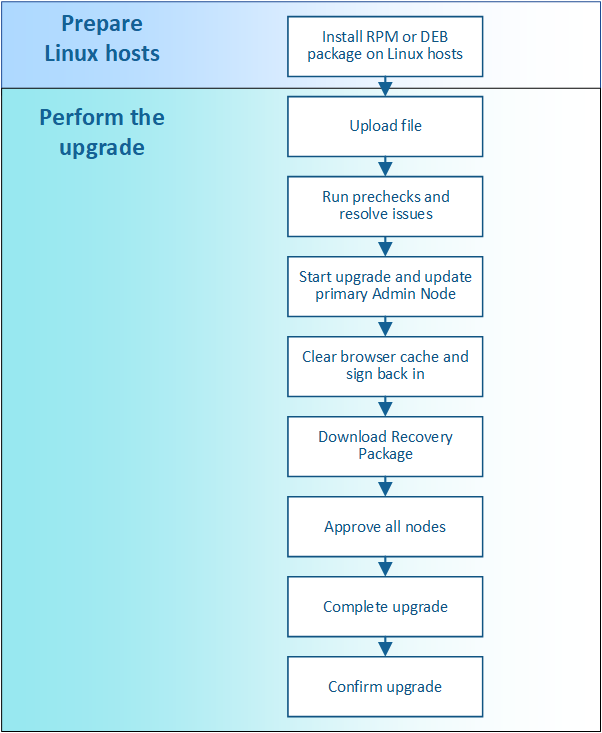

= Atualizar fluxo de trabalho
:allow-uri-read: 
:icons: font
:imagesdir: ../media/

[role="lead"]
Antes de iniciar a atualização, reveja o fluxo de trabalho geral. A página Atualização do StorageGRID orienta você em cada etapa de atualização.

. Se algum nó do StorageGRID for implantado em hosts Linux, xref:linux-installing-rpm-or-deb-package-on-all-hosts.adoc[Instale o pacote RPM ou DEB em cada host] antes de iniciar a atualização.
. No nó de administração principal, acesse a página Atualização do StorageGRID e faça o upload do arquivo de atualização.
. Opcionalmente, execute pré-verificações de atualização para detetar e resolver quaisquer problemas antes de iniciar a atualização real.
. Inicie a atualização, que executa verificações prévias e atualiza automaticamente o nó de administração principal. Não é possível acessar o Gerenciador de Grade enquanto o nó Admin principal estiver sendo atualizado. Os logs de auditoria também estarão indisponíveis. Esta atualização pode demorar até 30 minutos.
. Depois que o nó de administração principal tiver sido atualizado, limpe o cache do navegador da Web, entre novamente e retorne à página Atualização do StorageGRID.
. Baixe um novo pacote de recuperação.
. Aprove os nós da grade. Você pode aprovar nós de grade individuais, grupos de nós de grade ou todos os nós de grade.
+

IMPORTANT: Não aprove a atualização para um nó de grade a menos que você tenha certeza de que o nó está pronto para ser interrompido e reinicializado.

. Retomar as operações. Quando todos os nós de grade tiverem sido atualizados, novos recursos serão ativados e você poderá retomar as operações. Você deve esperar para executar um procedimento de desativação ou expansão até que a tarefa *Upgrade Database* em segundo plano e a tarefa *etapas de atualização final* tenham sido concluídas.
. Quando a atualização estiver concluída, confirme a versão do software e aplique quaisquer correções.

.Informações relacionadas
xref:estimating-time-to-complete-upgrade.adoc[Estime o tempo para concluir uma atualização]
