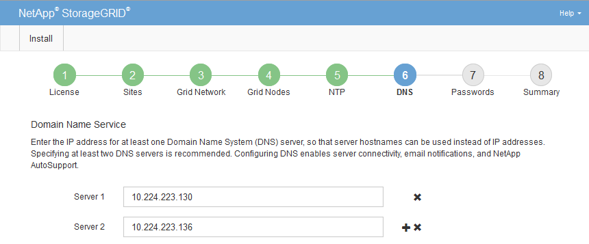

= Especifique as informações do servidor do sistema de nomes de domínio
:allow-uri-read: 
:icons: font
:imagesdir: ../media/

[role="lead"]
Você deve especificar informações do sistema de nomes de domínio (DNS) para o seu sistema StorageGRID, para que você possa acessar servidores externos usando nomes de host em vez de endereços IP.

.Sobre esta tarefa
Especificar informações do servidor DNS permite que você use nomes de host de nome de domínio totalmente qualificados (FQDN) em vez de endereços IP para notificações de e-mail e AutoSupport. É recomendável especificar pelo menos dois servidores DNS.

IMPORTANT: Forneça dois a seis endereços IPv4 para servidores DNS. Você deve selecionar servidores DNS que cada site pode acessar localmente no caso de rede ser aterrissada. Isso é para garantir que um site islanded continua a ter acesso ao serviço DNS. Depois de configurar a lista de servidores DNS em toda a grade, você pode personalizar ainda mais a lista de servidores DNS para cada nó. Para obter detalhes, consulte as informações sobre como modificar a configuração DNS nas instruções de recuperação e manutenção.

Se as informações do servidor DNS forem omitidas ou configuradas incorretamente, um alarme DNST será acionado no serviço SSM de cada nó da grade. O alarme é apagado quando o DNS está configurado corretamente e as novas informações do servidor atingiram todos os nós da grade.

.Passos
. Especifique o endereço IPv4 para pelo menos um servidor DNS na caixa de texto *Server 1*.
. Se necessário, selecione o sinal de adição ao lado da última entrada para adicionar entradas adicionais do servidor.
+

+
A prática recomendada é especificar pelo menos dois servidores DNS. Você pode especificar até seis servidores DNS.

. Selecione *seguinte*.

.Informações relacionadas
xref:../maintain/index.adoc[Recuperar e manter]
